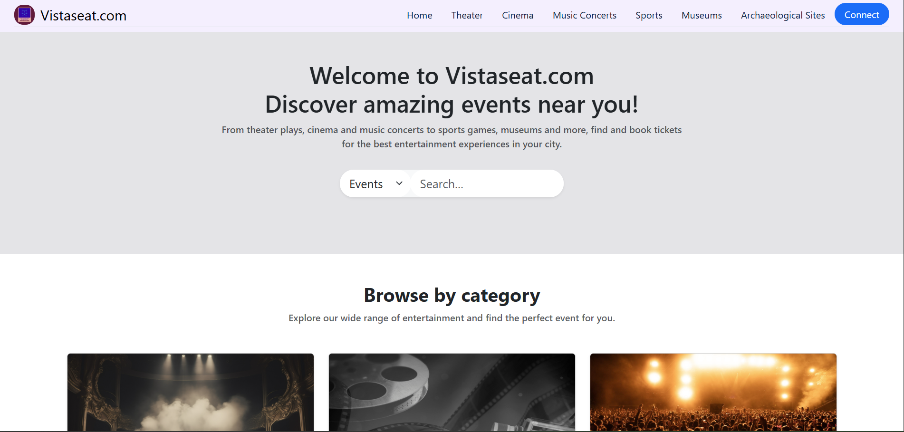

# 🎟️ Vistaseat.com — Integrated Event Ticketing & Seat Reservation System

> **Full-Stack Java Web Application** | MSc Dissertation Project | University of Piraeus — Department of Informatics

A feature-rich **ticket booking platform** that enables users to explore, reserve, and purchase tickets for cultural and entertainment events — built with **Spring Boot**, **PostgreSQL**, and **Thymeleaf**, following the **MVC architecture** and **RESTful design principles**.

---

## 📖 Table of Contents
1. [🌐 Overview](#-overview)
2. [👤 User Mode](#-user-mode)
3. [🛠️ Admin Mode](#-admin-mode)
4. [🧩 System Architecture](#-system-architecture)
5. [🔐 Authentication & Authorization](#-authentication--authorization)
6. [🔧 Technologies & Tools](#-technologies--tools)
7. [🎓 Academic Context](#-academic-context)
8. [🚀 Future Enhancements](#-future-enhancements)
9. [📸 Preview & Demo](#-preview--demo)
10. [📬 Contact](#-contact)

---

## 🌐 Overview

**Vistaseat.com** is a B2C ticketing system that simulates a real-world event booking platform.  
It offers two operational modes — **User Mode** and **Admin Mode** — to deliver both a polished customer experience and a powerful administrative backend.

### Supported Event Categories
- 🎭 Theater Plays
- 🎬 Cinema Films
- 🎶 Music Concerts & Festivals
- ⚽ Sporting Events
- 🏛️ Museum Visits
- 🏺 Archaeological Sites

---

## 👤 User Mode

The **User Mode** provides a seamless experience for event exploration, seat reservation, and payment processing.

### 🧾 Core Features
- **Registration & Guest Access:** Users can browse events as guests or register to access full functionality.
- **My Account:** Registered users can
    - Edit their personal information
    - View past and upcoming bookings
    - Submit testimonials (0.5–5⭐ ratings + written reviews)
- **Event Browsing:**
    - Explore events by name, category, or venue
    - View detailed info — date, time, duration, price, and seat availability
    - Filter by event name or date range
- **Booking & Payment:**
    - Select up to **10 tickets per event occurrence**
    - **Luhn algorithm validation** for credit/debit card numbers
    - Payment methods: **Credit/Debit Card** or **PayPal**
    - 15-minute checkout timer for booking confirmation
    - Post-booking: download **PDF tickets** with unique identifiers
- **Support & Info Pages:**
    - “About Us”, “FAQ”, and a **Contact Form** for user queries

---

## 🛠️ Admin Mode

The **Admin Dashboard** is the control center of the application — providing full oversight of users, venues, events, bookings, and testimonials.

### 🏠 Home Dashboard
- **KPIs at a Glance:** Total Users, Events, Venues, Bookings, and Revenue
- **Activity Feed:** Latest user registrations and booking records

### 👥 Manage Users
- Search by first or last name; filter by role (Admin/Registered)
- Toggle user status (active/inactive)
- Delete users with no existing bookings

### 🏟️ Manage Venues
- View and manage venue details: name, address, capacity, total events
- Add, edit, or delete venues (with integrity constraints)
- Browse and manage all events scheduled for each venue

### 🎫 Manage Events & Occurrences
- Add, edit, or delete events and their scheduled occurrences
- Enforce 30-minute windows between event occurrences
- Track seat availability with color-coded **availability badges:**
    - 🟩 >50%, ⚪ 50–25%, 🟧 25–0.1%, 🟥 Sold Out

### 🧾 Manage Bookings
- Search by booking ID, customer email, event, or date range
- View and edit full booking details, including payment info
- **Cancel bookings** (refunds processed via original payment method)
- **Reschedule events** where applicable

### 💬 Manage Testimonials
- Approve or hide user testimonials (limit: 10 visible at once)
- Delete inappropriate or outdated feedback

### 📩 Manage Contact Messages
- Review and resolve user-submitted issues
- Add internal admin notes
- Track message status (**In Progress / Resolved**)

---

## 🧩 System Architecture

| Layer | Description |
|-------|--------------|
| **Presentation Layer** | Responsive UI built with **HTML, CSS, JavaScript**, and **Thymeleaf** templates |
| **Business Logic Layer** | Implemented with **Spring Boot** (MVC & REST controllers) |
| **Persistence Layer** | **Spring Data JPA** and **Hibernate ORM** for database management |
| **Database** | **PostgreSQL** with entity relationships between Users, Events, Venues, and Bookings |
| **Security Layer** | **Spring Security** with dual filter chains for User Mode and Admin Mode |
| **Password Encryption** | **BCryptPasswordEncoder** |
| **Payment Validation** | **Luhn Algorithm** for card number verification |
| **PDF Generation** | Automatic PDF ticket generation post-purchase |

---

## 🔐 Authentication & Authorization

- **Role-based access control:** Guest | Registered User | Admin
- Two separate **Spring Security filter chains** for User and Admin modes
- Session-based authentication for persistent login
- Passwords securely hashed with **BCrypt**

---

## 🔧 Technologies & Tools

### Backend
- ☕ **Java 21**
- 🌱 **Spring Boot**, **Spring MVC**, **Spring Data JPA**, **Spring Security**
- 🗃️ **PostgreSQL**
- 🧩 **Hibernate ORM**
- 🔐 **BCrypt** for password hashing
- 🌐 **RESTful APIs**

### Frontend
- 🧱 **HTML5**, **CSS3**, **JavaScript**
- 🧠 **Thymeleaf** template engine
- 📱 Fully **responsive design**

### Development & Deployment
- 💻 **IntelliJ IDEA**
- 🐘 **PostgreSQL** local instance
- ⚙️ **Maven** for dependency management
- 🐙 **GitHub** for version control

---

## 🎓 Academic Context

This project was developed as part of my **MSc Dissertation** at the  
**University of Piraeus – Department of Informatics**, titled:

> **"Design and Development of an Integrated Ticketing and Seat Reservation System"**

The system replicates real-world event ticketing workflows, demonstrating applied knowledge in:
- Software architecture (MVC + REST)
- Database design and entity relationships
- Secure user authentication and role-based access
- Payment handling and session management
- UI/UX design in full-stack Java web applications

---

## 🚀 Future Enhancements
- **Analytics dashboard** for performance and sales insights
- Implement an **interactive seat selection** feature by displaying the floor plan of each venue.
- Addition of **QR/barcode scanning** for ticket validation
- **Email notifications** for order confirmations

---

## 📸 Preview & Demo

### 🎥 Video Presentation
> *Coming soon!*  
> *(Click above to watch a short walkthrough of the project in action!)*

### 🖼️ Application Snapshots

#### 🧑‍💻 User Mode
| Home Page                                                    | Events Display                                                        | Available Showtimes                                                         | Booking Confirmation                                                               |
|--------------------------------------------------------------|-----------------------------------------------------------------------|-----------------------------------------------------------------------------|------------------------------------------------------------------------------------|
|  |  |  |  |

#### 🛠️ Admin Mode
| Dashboard                                                                | Manage Event Occurrences                                                        | Manage Bookings                                                          | Manage Testimonials                                                       |
|--------------------------------------------------------------------------|---------------------------------------------------------------------------------|--------------------------------------------------------------------------|---------------------------------------------------------------------------|
|  |  |  |  |

> 📂 *All preview images are stored inside the `images/` directory of this repository.*

---

## 📬 Contact

👤 **Georgios Simos**  
📧 [Email Me](mailto:giorgos_simos@windowslive.com)  
🌐 [LinkedIn](www.linkedin.com/in/georgios-simos-5a7497260)

---

> © 2025 **Georgios Simos**  
> *A demonstration of modern web technologies applied to real-world ticketing systems — designed with scalability, usability, and precision in mind.*
